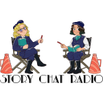

# Welcome to Story Chat Radio!

{.float-left}

We are book editors Carly Hayward and Jeni Chappelle, and we put ourselves through the arduous tasks of picking movies. And then watching the movies. And then thinking and talking about the movies. Not to mention the popcorn.

All for you and your story. We know—we sacrifice so much…

Every month we watch a different movie with an eye for storytelling and novel writing. Then we use our training and years of experience editing novels to break down different storytelling elements to help you improve your novel-in-progress.

Like and subscribe to the podcast on [Apple Podcasts](https://podcasts.apple.com/us/podcast/story-chat-radio/id1483688097?target=_blank), [Spotify](https://open.spotify.com/show/3o7zYGOeJMHfKFdCrhlILb?target=_blank), [Google Podcasts](https://podcasts.google.com/?feed=aHR0cHM6Ly9zdG9yeWNoYXRyYWRpby5saWJzeW4uY29tL3Jzcw&ep=14), and [YouTube](https://www.youtube.com/channel/UCVgBO3mHLqhtVZWRn0BmFEA?target=_blank).

You can reach us on [Twitter](https://twitter.com/StoryChatRadio?target=_blank), [Instagram](https://www.instagram.com/storychatradio?target=_blank), or via email at storychatradio@gmail.com.

!!!!! "Short version: Story Chat Radio is amazing, and everyone should listen.
!!!!! 
!!!!! Long version: Jeni and Carly provide insightful commentary that is both thought provoking and inspiring. Their understanding of storytelling is masterful, and I love that they use movies to help improve novel writing. 
!!!!! 
!!!!! It's so refreshing to find people that are uplifting with their advice. People who can critique without condescension are rare, but Jeni and Carly nail it EVERY time as they offer their thoughts in a way that encourages authors to be better while also reassuring them of their ability to so."
!!!!! 
!!!!! -_Neha Das_